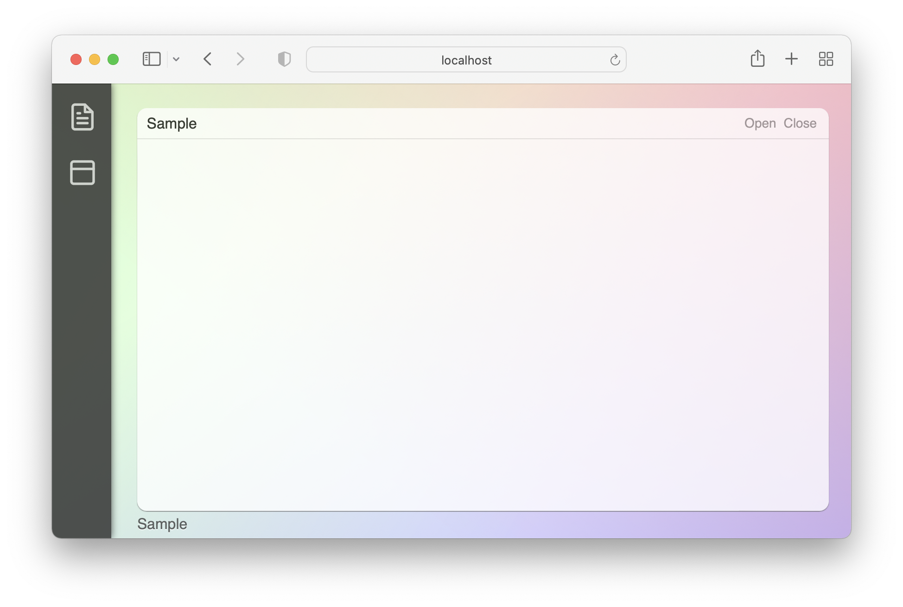

## Artfully Application


Making an application in Artfully platform.

An easy way to write application by creating a 
JavaScript class.

```javascript
class Sample extends Application {
	create() {
		this.setTitle("Sample")
		let menu = new Menu()
		menu.add("Open",  () => this.open() )
		menu.add("Close", () => this.exit() )
		this.setMenu(menu)
	}
	open() {
		console.log("Open ...")
	}
}

System.registerApplication("Sample")
```

The function System.registerApplication()
is use for registering a class name as
an application.

The result is as follow:




It is possible to write application
by any framework, e.g. React.

```javascript
<script src="https://unpkg.com/react@18/umd/react.development.js"></script>
<script src="https://unpkg.com/react-dom@18/umd/react-dom.development.js"></script>
<script src="https://unpkg.com/@babel/standalone/babel.min.js"></script>

<script type="text/babel">

class ReactApp extends React.Component {
	constructor() {
		super()
		this.list = [ ]
	}

	render() {
		return <div>
			<button onClick={()=>this.add()}>Add</button>
			{this.list.map(x => <p>{x}</p>)}
		</div>
	}
	add() {
		this.list.push("Love")
		this.forceUpdate()
	}
}

class ReactBridge extends Application {
	create() {
		this.setTitle("React Sample Application")
		let menu = new Menu()
		menu.add("Open",  () => this.open() )
		menu.add("Close", () => this.exit() )
		this.setMenu(menu)
		
		let target = document.createElement("span")
		this.getMain().appendChild(target)
		
		let root = ReactDOM.createRoot(target)
		root.render(<ReactApp />)
	}
	open() {
		console.log("Open ...")
	}
}

System.registerApplication("ReactBridge")	
</script>
```
